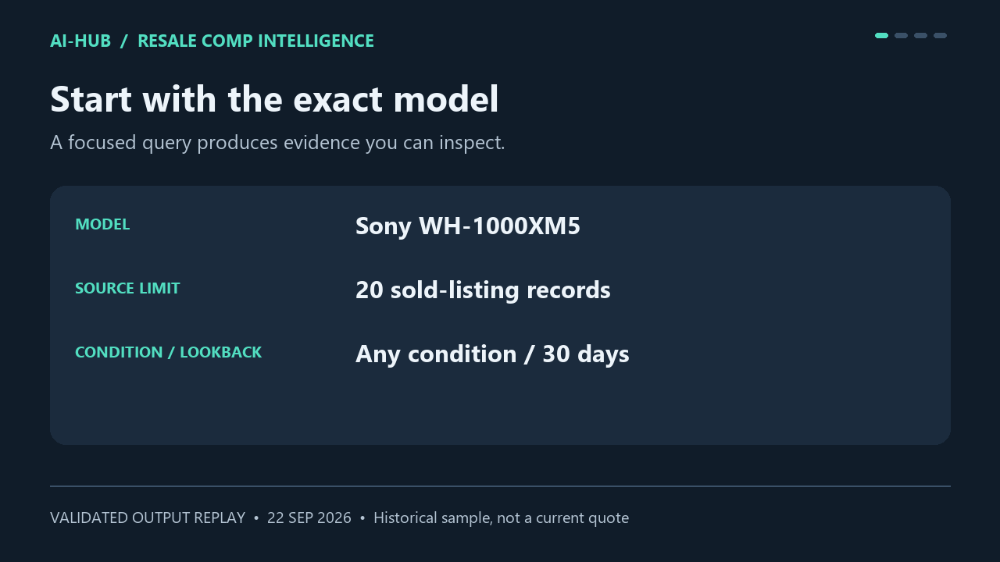

# AI-Hub services

Structured evidence for resale research and Solana agent workflows.

| Service | What you receive | Price | Where to start |
| --- | --- | --- | --- |
| eBay Sold Comps — Resale Comp Intelligence | Price percentiles, comparable-listing evidence, exclusion counts and optional profit scenarios | $0.25 per successful analysis, plus separate source fees up to $0.10 | [Open on Apify](https://apify.com/mddunno128/resale-comp-intelligence) |
| Solana Token Risk Evidence | Timestamped market and provider-reported risk evidence, explicit missing-data warnings and source URLs | 0.02 USDC per ACP job | Search **Solana Token Risk Evidence** in the ACP marketplace; provider **CryptoLab Solana Evidence** |

## See a real result before running



This is a visual replay of saved validation output, not a live screen recording. The September 22, 2026 sample returned **16 retained comps from 20 records** for Sony WH-1000XM5, with a **$127.84 median**. The query allowed any condition, so the evidence mixes used and refurbished listings. It is a historical sample, not a current valuation or guaranteed selling price.

- [Resale input](resale-input.json) and [sanitized output](resale-output.json)
- [Step-by-step resale walkthrough](RESALE-WALKTHROUGH.md)
- [Solana evidence example](solana-evidence.json) and [integration notes](SOLANA-QUICKSTART.md)

## Buy a resale analysis

1. Open the [Apify product](https://apify.com/mddunno128/resale-comp-intelligence) in your own account.
2. Enter the brand and exact model, condition and lookback. Request up to 20 listings.
3. Review the price and run limits before starting. The analysis event is $0.25; the separate source event budget is capped at $0.10. Platform/account charges can differ from event charges.
4. Review the output's quality warnings and evidence links, then export the dataset for your workflow.

Fewer than five usable comps means no analysis charge, but the separate source charge may still apply. Best Offer accepted prices are not recovered; those listings are excluded by default. Optional profit scenarios depend on your costs and are not forecasts.

## Integrate Solana evidence

With an existing ACP CLI installation, this is a read-only discovery command:

```sh
acp browse "Solana Token Risk Evidence" --top-k 10 --online all --json
```

Match provider **CryptoLab Solana Evidence**, agent ID `01a0bff5-004e-718e-9a5b-7ea227cf3be2`, and the exact offering name. Hiring is a separate paid action; verify the current price in your own ACP client. No wallet connection, trading or funds transfer is part of the evidence deliverable.

## Validation and limitations

The resale example came from a successful build 0.1.4 run with one saved analysis and one analysis event. The Solana example came from a public-data evidence probe; it reports partial data because holder concentration was unavailable. Neither example proves a paid customer transaction. At preparation on September 22, no external customer payment had been verified.

The mini PC runs the ACP provider and local operations. Resale analyses execute on Apify. Evidence can be incomplete, stale or incorrect; check sources. Solana output is not a safety certification or buy/sell recommendation.

## Feedback

Open an issue in this repository with the product, expected behavior, sanitized input and error. Do not include API tokens, private wallet information, account screenshots or personal billing details. For resale support you can also use the product's Apify Issues tab.

Built by [AI-Hub / MDDunno128](https://github.com/MDDunno128).
